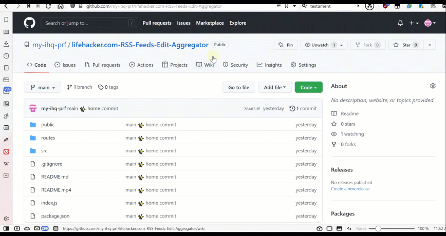

# lifehacker.com RSS Feeds Edit Aggregator

## Live | Demo:

### ***[ - replit.com](https://lhk-rss.ify2.repl.co)***
### ***[ - render.com](https://lhc-rss.onrender.com)***

## Tutorial:


## Installation

```sh

git clone https://github.com/my-ihq-prf/lifehacker.com-RSS-Feeds-Edit-Aggregator.git
CD /D lifehacker.com-RSS-Feeds-Edit-Aggregator

npm i

```

## Run

```sh

  npm run "start:srv"

```

## Debug

```sh
# PORT - 3000 by default
npm i -D nodemon
set PORT=3000&& nodemon ./index.js
# OR
package.json
  "scripts": {
    "dev:srv": "nodemon ./index.js"
  },

```

## Implementation
___
- [x] DB 'posts' table (try in different browsers with changes to check)
___
- [x] Worker:
___
- [x] CRUD:
- - [x] read - GET
- - [x] create - POST
- - [x] update - PUT
- - [x] delete - DELETE
___
- [x] Admin UI SPA:
- - [x] pagination
- - [x] sort
- - [x] search
___
- [x] JWT Auth:

> The JWT Auth has been replaced by JWE Auth! Why? Because:

### 📜 Web Testament

-   **DON’T** use http
-   **DON’T** store sensitive data in JWT
-   **DO** Use https / wss
-   **DO** manually audit your certificates
-   **DO** validate users
-   **DO** remember that JWT isn’t encrypted per sé
-   **DO** use JWE instead of JWT and use AES256 CBC + HMAC SHA512
-   **DO** double-down and perform the complete OWASP web audit

## Deployment
___
### ***[ -> replit.com:](https://replit.com)***

```sh
    1.Create -> Import from GitHub
      - GitHub URL:
         https://github.com/my-ihq-prf/lifehacker.com-RSS-Feeds-Edit-Aggregator.git
      - Connect GitHub
    2.[Right top block]:
      - scroll to bottom [Done]
    3.Left nav[Secrets (Environment variables)]:
      - Add new secret
        key: PORT
        value: 8000
      - [Add new secret]

    3.Left nav[Version control]:
      - ... changed files or folders
        - .replit
          put:

language = "nodejs"
run = "set PORT=8000&&node ./index.js"

      - above[Commit & push →]


    4.Run (Top green button with arrow or Ctrl+Enter)
```
___

### ***[ -> render.com:](https://render.com)***
### - [doc](https://render.com/docs/deploy-node-express-app)

in 2st.  Use the following values during creation:

```sh
    **Environment**

    Node

    **Build Command**

    yarn

    **Start Command**

    set PORT=8000&&node ./index.js
```
OR

```sh
    1.[Settings]
      - Start Command
        - [Edit]
          - put

            set PORT=8000&&node ./index.js

```

___

```sh
    2.[Environment]
      - [Add Environment Variable]
        Key: PORT
        Value: 8000
```
___
